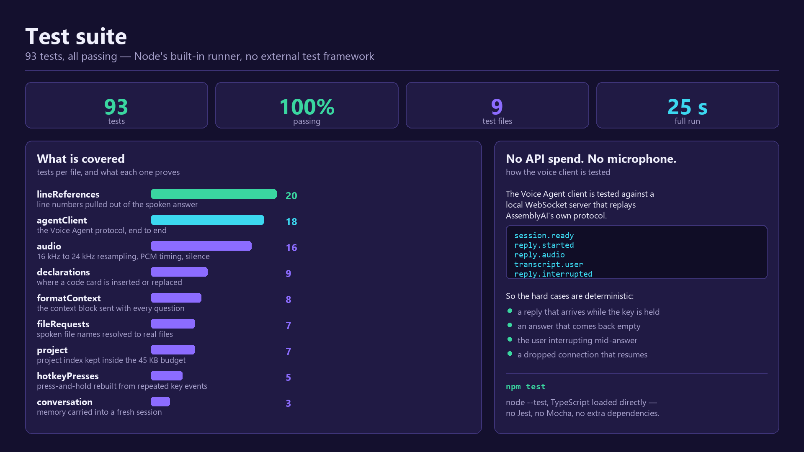

# EchoCode — Voice-First AI Pair Programmer


EchoCode is a VS Code extension that lets you ask about your code out loud and hear the answer, like pair programming with a senior engineer.

**[Landing page](https://echo-code-hackathon.vercel.app)** · **[Download the extension](https://github.com/TeyYongZhun/EchoCode-Hackathon/releases/latest)** · **[Try it in 2 minutes](#try-it)**

---

## In 30 seconds

- **The problem:** asking an AI about your code means typing long prompts and copy-pasting code into a chat window. Students skip it and paste answers they don't understand.
- **Our solution:** hold one key and ask out loud. EchoCode reads the file you're in *and the rest of your project*, answers by voice, opens the file it is talking about and lights up the lines, then hands you the fix as one-click code. Ask it to *"open the LinkedList file"* and it takes you there.
- **Built on AssemblyAI:** the **Voice Agent API** runs the spoken conversation, and the **LLM Gateway** writes the code for suggested fixes.
- **Who it's for:** computer science students and junior developers who learn best by talking a problem through.

## Problem Statement

When you hit a hard algorithm or unfamiliar code, today's AI assistants make you:

1. Stop and type a long, precise prompt.
2. Copy and paste code and error messages into a chat window.
3. Work out which part of your code each line of the answer means.

It's so much effort that many people give up and paste in code they don't understand. We call it **"vibe coding" fatigue**.

## How it works

1. **Wake it.** Press Ctrl+Alt+Space once. EchoCode says hello and stays ready.
2. **Hold the same key and ask** out loud: *"Why is this so slow?"*, *"Where do I change the font?"* or *"open the LinkedList file"*. Let go to send. Select some code first if your question is about a particular part.
3. **Listen and apply.** A senior-engineer voice explains, the lines it mentions light up — opening another file when the answer lives there — and a suggested fix appears with a **Replace lines** button.

EchoCode already knows which file you're in, where your cursor is, what you selected, any compiler errors, and the other files in your project, so you never copy-paste anything.

## Key features

| Feature | What it means for you |
|---|---|
| 🎙️ **Talk, don't type** | Hold a key and ask, like asking a colleague. Nothing is recorded until you press it. |
| 📄 **Knows your code** | Your file, selection and errors go with every question automatically. |
| 📁 **Knows your project** | The other files go too, so "where do I change the font?" finds `style.css`, opens it and lights up the line. |
| 🧭 **Takes you there** | Ask it to *"open the globals.css file"* and the file comes up with your cursor in it. A name heard slightly wrong — "global.css" — still finds it. |
| 🔦 **Points at the code** | Lines light up at the moment they're mentioned in the answer. |
| ⚡ **One-click fixes** | Suggested code appears as a card: **Replace lines** or **Insert at Cursor**. |
| ✋ **Interrupt any time** | Press the key mid-answer to ask something else. |
| 💬 **Read along** | The answer appears in the conversation as it is spoken. The robot shows only what it is doing: listening, thinking, speaking. |
| ⚙️ **Your settings** | See your plan and minutes left, change the hotkey, and pick a panel background. |

## How EchoCode uses AssemblyAI

| AssemblyAI product | What it does in EchoCode |
|---|---|
| **Voice Agent API** | Runs the whole spoken conversation in one streaming session: it hears the question, reasons over your code and speaks the answer. Coding **key terms** (HashSet, generics, null pointer…) improve recognition, **turn detection** closes the question when you stop talking (EchoCode also nudges it on hotkey release), and **word-level timing** lights up each line at the moment it is spoken. Interrupting a playing answer is handled by EchoCode: the session is ended and the next question opens a fresh one, carrying the conversation so far. |
| **LLM Gateway** | Writes the exact code behind a suggested fix as JSON, using `qwen3.5-4b-32k-fast` (set `ASSEMBLYAI_SUGGEST_MODEL` to use a stronger model your account has access to). It runs after the voice answer, so it never slows the conversation down. |
| **Single-use tokens** | Our backend keeps the AssemblyAI API key secret and gives the extension a short-lived token for each conversation. |

## Architecture

![EchoCode architecture: the VS Code editor and voice panel sit on top of the EchoCode extension, which holds the core logic. It captures editor and project context, streams mic audio to AssemblyAI's Voice Agent over one WebSocket session, plays the spoken reply and acts on it by highlighting lines, opening files and offering code cards. Over HTTPS it calls an EchoCode backend on Vercel that holds the API key, mints single-use session tokens and meters usage; that backend calls the AssemblyAI LLM Gateway to write each code card.](docs/architecture.svg)

- **The key stays safe.** Only the backend on Vercel knows the AssemblyAI API key. The extension gets a single-use token that expires within two minutes.
- **The voice is fast.** Audio goes straight from VS Code to AssemblyAI, with no server in between.
- **Costs stay low.** Unused sessions close after 3 minutes, and each user's voice minutes are counted in Upstash Redis against their plan. Every session is capped at 15 minutes, and session tokens are rate-limited per install and per IP with a daily ceiling across all users, so the worst day's spend is bounded.
- **What leaves your machine.** Your audio and the editor/project context go to AssemblyAI to be answered. The code-card request (context, question, spoken answer) is posted to our Vercel backend, which forwards it to the LLM Gateway; it isn't stored. Redis only ever holds a random install id and seconds of voice used.

## Business model

**We sell to institutions, not to students.** Individuals use EchoCode free; the invoice goes to the bootcamp or department whose measured outcome improves. Students are the way in, not the customer.

- **The user:** a second-year undergraduate at 11pm with an AI chat open in another window, who has already pasted in code they cannot explain.
- **The buyer:** the programme director or course lead who is failing to teach them. Bootcamps decide in weeks and are scored on completion rate, so they come first; university departments are the larger contract and are sold into course by course.
- **Who it's really for:** people who have to read code they didn't write. AI codegen is growing that group far faster than any enrolment figure is shrinking it.

| Plan | Price | Included | Status |
|---|---|---|---|
| **Free** | $0 | 10 minutes of voice a month, about 13 questions | **Available today** |
| **Pro** | $20/month, or $192/year | 60 questions a month, about 45 minutes of voice | Not on sale yet |
| **Cohort** | $25 per learner, once, for a 12-week cohort | Everything in Pro for every learner, minutes pooled across the cohort | Not on sale yet |
| **Campus** | $36 per seat, per academic year | Everything in Pro for every student, minutes pooled across the department | Not on sale yet |

- **Unit economics:** the Voice Agent API bills **per second of session duration** at $0.075 a minute — not per minute of speech. A question is about 45 seconds of talking, but today's 3-minute idle timeout holds the session open for about 3 minutes, so it costs roughly **$0.22**. At a 60-second idle timeout it costs about **$0.13**. Code cards add $0.0014 each through the LLM Gateway, under 1% of cost of goods sold.
- **Margins:** our year-one model assumes the 60-second idle timeout planned for the next 90 days ($0.13 a question): **81%** on a cohort deal, **62%** on a campus deal, **61%** on Pro, and about **63%** overall. At today's 3-minute timeout the same model gives 68%, 34%, 33% and about 36%, which is why the timeout change comes first. Voice is a genuine cost of goods, so this is a 57–81% business rather than the 90% of pure software.
- **Cost roadmap:** idle session time is the cost driver, not question volume. Cutting the idle timeout from 3 minutes to 60 seconds takes cost per question from $0.22 to $0.13 (42% less), for one extra reconnect on follow-ups asked after a minute's pause.

## Try it

You need desktop VS Code 1.95 or later (1.106 or later to get EchoCode in the right panel; older versions show it in the Explorer) and a microphone. Headphones help. No API key is needed.

1. **Install:** download `echocode-0.1.4.vsix` from the [latest release](https://github.com/TeyYongZhun/EchoCode-Hackathon/releases/latest). In VS Code, open the Extensions view, click **⋯ → Install from VSIX…** and pick the file. Don't double-click the file: on Windows that opens Visual Studio's installer instead.
2. **Open the demo:** download this repository and open its `demo/` folder in VS Code.
3. **Check your mic:** press **Ctrl+Shift+P** and run **EchoCode: Test Microphone**.
4. **Wake EchoCode:** press **Ctrl+Alt+Space** (**Ctrl+Shift+Space** on macOS) once. It says hello, and stays ready.
5. **Ask:** open a demo file, select the code below, click inside the editor, then **hold** the same key, ask, and let go. You can also click **🤖 EchoCode** in the status bar instead.

| Demo file | Select | Ask |
|---|---|---|
| `GenericStack.java` | the `push` method | *"Walk me through this method. Why does it double the array?"* |
| `DuplicateFinder.java` | the `findDuplicates` method | *"Why is this so slow with a big list? How do I fix it?"* Then click **Replace lines** on the code card. |
| `LinkedList.java` | the `removeLast` method | *"Why does this crash?"* |

You can also just ask to be taken somewhere, without asking about the code: *"open the duplicate finder"* or *"show me LinkedList.java"* brings the file up with your cursor in it. If the name could mean two files, EchoCode asks which one you meant rather than guessing.

The answer plays in the **EchoCode** tab of the right panel (**Ctrl+Alt+B** shows or hides it), next to the conversation and code cards. The panel opens on a **Get started** card covering the microphone, the hotkey (including the default one, in case you've rebound it), ⚙ Settings and ■ Stop; your first question pushes it out of the way, and scrolling back to the top of the conversation brings it back. Click **⚙** there to see your plan and minutes left this month, change the hotkey, or change the panel background.

## Tech stack

| Part | Built with |
|---|---|
| Voice conversation | AssemblyAI Voice Agent API |
| Code suggestions | AssemblyAI LLM Gateway |
| VS Code extension | TypeScript, VS Code Extension API, esbuild |
| Microphone | PvRecorder (Windows, macOS and Linux) |
| Backend and landing page | Next.js on Vercel |
| Usage metering | Upstash Redis |

## Testing

```bash
cd extension
npm install   # first time only
npm test
```

**93 tests, all passing**, in about 25 seconds. They run on Node's built-in test runner (`node --test`) with TypeScript loaded directly — no Jest, no Mocha, no extra dependencies. You need Node 22.18 or later.



| File | Tests | What it proves |
|---|---|---|
| `lineReferences` | 20 | line numbers pulled out of the spoken answer, and which file each belongs to |
| `agentClient` | 18 | the Voice Agent protocol, end to end |
| `audio` | 16 | 16 kHz to 24 kHz resampling, PCM timing, silence detection |
| `declarations` | 9 | where a code card is inserted or replaced |
| `formatContext` | 8 | the editor context block sent with every question |
| `fileRequests` | 7 | spoken file names resolved to real files, ambiguity included |
| `project` | 7 | the project index kept inside the 45 KB budget |
| `hotkeyPresses` | 5 | press-and-hold rebuilt from repeated key events |
| `conversation` | 3 | memory carried into a fresh session |

**The voice client is tested without touching the live API.** `agentClient.test.ts` starts a local WebSocket server that replays AssemblyAI's own protocol — `session.ready`, `reply.started`, `reply.audio`, `transcript.user`, `reply.interrupted` — so the cases that are hardest to reproduce by hand are deterministic and cost nothing to run:

- a reply that arrives while the hotkey is still held
- an answer that comes back empty, and the real one that follows it
- the user interrupting mid-answer
- a dropped connection that resumes the same conversation

That is also why the suite takes ~25 seconds rather than milliseconds: the timing tests wait in real time, because they are checking *when* something fires, not just what it returns.

To run one file while you work on it:

```bash
node --import ./test/resolveTs.mjs --test test/agentClient.test.ts
```

## Repository layout

```
EchoCode-Hackathon/
├── extension/                    the VS Code extension
│   ├── src/
│   │   ├── extension.ts          starts EchoCode
│   │   ├── SessionController.ts  runs each voice question
│   │   ├── audio/                microphone and resampling
│   │   ├── context/              editor and project context, line and file references
│   │   ├── voice/                AssemblyAI client, API calls
│   │   └── ui/                   panel, highlights, code cards
│   ├── webview/                  panel UI and audio playback
│   ├── scripts/                  npm run dev launcher
│   └── test/                     unit tests
├── backend/                      Next.js backend on Vercel
│   ├── app/api/token/            single-use voice tokens
│   ├── app/api/suggest/          code cards
│   ├── app/api/usage/            voice minutes per plan
│   ├── app/api/health/           status check
│   ├── app/page.tsx              landing page
│   └── lib/                      prompt, AssemblyAI, usage
├── demo/                         Java files for the live demo
└── docs/                         architecture diagram
```

## Deployment

| Component | Platform | Notes |
|---|---|---|
| VS Code extension | GitHub Releases | Build with `npm run package` in `extension/` and attach the `.vsix` to a release |
| Backend and landing page | Vercel | Root Directory `backend`, Framework Preset Next.js, add the `ASSEMBLYAI_API_KEY` env variable |
| Voice and code suggestions | AssemblyAI | Voice Agent API and LLM Gateway; the API key lives only on the backend |
| Usage database | Upstash Redis (Vercel Marketplace) | Optional; turns on the monthly voice allowance (10 minutes on Free) |

Live backend and landing page: https://echo-code-hackathon.vercel.app

---

## For developers

<details>
<summary><b>Run from source</b></summary>

You'll need Node.js 22.18 or later (24 recommended).

```bash
cd extension
npm install
npm run dev
```

This builds EchoCode, checks that the backend is reachable, and opens a VS Code window on the `demo/` folder with the extension loaded. **Run EchoCode** from the Run and Debug view does the same with the debugger attached. Every step is logged in **View → Output → EchoCode**.

</details>

<details>
<summary><b>Run your own backend</b></summary>

You'll need an AssemblyAI API key from your [AssemblyAI dashboard](https://www.assemblyai.com/dashboard).

```bash
cd backend
npm install
cp .env.example .env.local   # then put your key in ASSEMBLYAI_API_KEY
npm run dev                  # serves http://localhost:3000
```

Set `echocode.backendUrl` to `http://localhost:3000` in VS Code. From `extension/`, run `ECHOCODE_BACKEND_URL=http://localhost:3000 npm run dev` to have the launcher start the backend for you.

To deploy on Vercel, import the repository, set **Root Directory** to `backend` and **Framework Preset** to Next.js, and add `ASSEMBLYAI_API_KEY`. To switch on the monthly voice minutes, add **Upstash Redis** from the Vercel Marketplace and redeploy. Without it, usage isn't counted and nothing is blocked. Every option is listed in `backend/.env.example`.

</details>

<details>
<summary><b>Commands and settings</b></summary>

| Where | Command | What it does |
|---|---|---|
| `extension/` | `npm run dev` | Builds EchoCode and opens VS Code on `demo/` with it loaded |
| `extension/` | `npm test` | 93 unit tests — see [Testing](#testing) |
| `extension/` | `npm run typecheck` | Type-checks the extension and the webview |
| `extension/` | `npm run watch` | Rebuilds on save (reload the window to pick up changes) |
| `extension/` | `npm run package` | Builds `echocode-0.1.4.vsix` with the microphone library for every platform |
| `backend/` | `npm run dev` | Runs the backend at http://localhost:3000 |
| `backend/` | `npm run smoke` | Asks the Voice Agent one question through the backend and reports the reply and latency |
| `backend/` | `npm run build` | Production build of the backend and landing page |

| Setting | Default | What it does |
|---|---|---|
| `echocode.backendUrl` | `https://echo-code-hackathon.vercel.app` | The backend that issues session tokens |
| `echocode.micDeviceIndex` | `-1` | Microphone to record from; `-1` is the system default |
| `echocode.maxContextLines` | `400` | Lines of the open file sent with each question. The other project files go alongside it, within a 45 KB budget |
| `echocode.autoStopSilenceMs` | `2000` | Send automatically after this much silence; `0` turns it off |
| `echocode.panelBackground` | `midnight` | Panel background: `midnight`, `graphite`, `purple`, `ocean` or `vscode` (follow your theme). Also in the panel's ⚙ Settings |

</details>

<details>
<summary><b>How it works under the hood</b></summary>

- **Microphone:** VS Code's panels can't use the microphone, so the extension records 16 kHz audio with PvRecorder in a background thread. It resamples the audio to the 24 kHz the Voice Agent expects. Audio recorded while connecting, or before speech is confirmed, is sent at up to twice real time until it catches up with your voice: tested live, the Voice Agent hears it all and answers sooner, while sending much faster gains nothing.
- **Editor context:** each question carries the file path, language, cursor line, selection, the surrounding code with line numbers, and nearby compiler errors, up to 400 lines.
- **Project context:** the other source files in the open folder go too, so EchoCode can answer about code that isn't on screen. Measured against the live Voice Agent, a `session.update` much over **64 KB is rejected** with an unhelpful "Internal service error", while everything under it costs only about 150 ms — so EchoCode keeps the whole context under 45 KB. A small project (a student's web app is typically under 1,500 lines) is sent in full; a bigger one sends the files the open one references, then its neighbours, and names the rest. `node_modules`, `.git` and build output are always skipped, and unsaved edits are used over what's on disk.
- **Pointing at another file:** when the agent says "line 12 of style.css", EchoCode matches the spoken name against the project's real filenames — "style dot c s s" and "style css" both resolve — then opens that file without stealing keyboard focus and highlights the line. A name that could mean two files highlights neither, and a code card for another file inserts there rather than into whatever is open.
- **Waking up:** EchoCode connects to nothing until you first press the key, because AssemblyAI bills for the time a session is open. That first press opens the session and the agent says hello, which covers the two seconds connecting takes. Measured live, the first real question then starts answering in about 1.1 s instead of 2.2 s, because the session is already open.
- **Push-to-talk:** nothing is sent until you press the key, and if you don't speak, nothing is sent at all. Once you start speaking, the audio from half a second before is kept too, so a quiet first word isn't cut off. When you let go, a short tail of silence lets the Voice Agent's turn detection close the question. If no reply has started 1.2 seconds after the Voice Agent has the whole question, EchoCode asks for one directly. It never asks earlier, because asking before the question is fully heard gets an empty answer.
- **Line highlights:** the agent names lines out loud ("on line twenty-one"). The extension finds those references in the transcript and highlights each line when its word plays, using the Voice Agent's word timing, in whichever file was named.
- **One setup for everyone:** the prompt, voice, coding key terms and audio settings live in `backend/lib/agentConfig.ts`, and every session starts with them.
- **Reconnects:** a dropped connection resumes the same conversation if it's back within 30 seconds. When EchoCode has to start a fresh session instead (after a few idle minutes, or when you interrupt an answer), it passes the last few questions and answers to the new one, so the conversation carries on.
- **Interrupting:** tested live, the Voice Agent keeps playing an answer on its side after EchoCode silences it, and throws away a short question asked over it; the API can't cancel an answer. So pressing the key (or Stop) while an answer is still arriving ends that session, and your question goes to a fresh one, connected while you talk.
- **Why no proxy:** sending every audio packet through our own server would add delay, and Vercel's WebSocket support is still in beta with a 5-minute cap. Single-use tokens protect the key just as well, at direct-connection speed.

</details>

<details>
<summary><b>Troubleshooting</b></summary>

| Problem | Fix |
|---|---|
| No **🤖 EchoCode** in the status bar | Check the extension is installed and enabled, then run **Developer: Reload Window**. Right-click the status bar and make sure **EchoCode** is ticked. |
| The hotkey does nothing | Click inside a code editor first; the terminal and chat boxes take the key for themselves. Or click the status bar robot. If another extension uses the same key, pick a new one in the panel's **⚙ → Change hotkey**. |
| The first words of a question are wrong | Pause for a moment after pressing the key before you speak, and speak close to the microphone. If it keeps happening, raise the microphone's input level in your system sound settings. |
| Double-clicking the `.vsix` opens "VSIX Installer" and fails | That's Visual Studio's installer. Use **Extensions view → ⋯ → Install from VSIX…** in VS Code instead. |
| "Couldn't open the microphone" or silence in the mic test | On Windows, turn on **Settings → Privacy & security → Microphone → Let desktop apps access your microphone**, then run **EchoCode: Choose Microphone**. |
| "I didn't hear anything" | No speech was detected, so nothing was sent. Speak closer to the microphone. |
| The panel says **"EchoCode can't be heard yet"** | VS Code keeps a panel muted until you click inside it, and the hotkey is pressed in the editor. Click anywhere in the panel once, or press **Enable voice**; it lasts the rest of the session and comes back only after a window reload. |
| "EchoCode didn't answer that time" | No answer arrived within 20 seconds. Ask again; if it repeats, check **View → Output → EchoCode** for the reason. |
| "Extension host did not start in 10 seconds" | The window is waiting for a debugger. Close it and use `npm run dev` in `extension/` instead. |
| "Can't reach the EchoCode backend" | Check your internet connection, or run the backend locally. |

</details>
